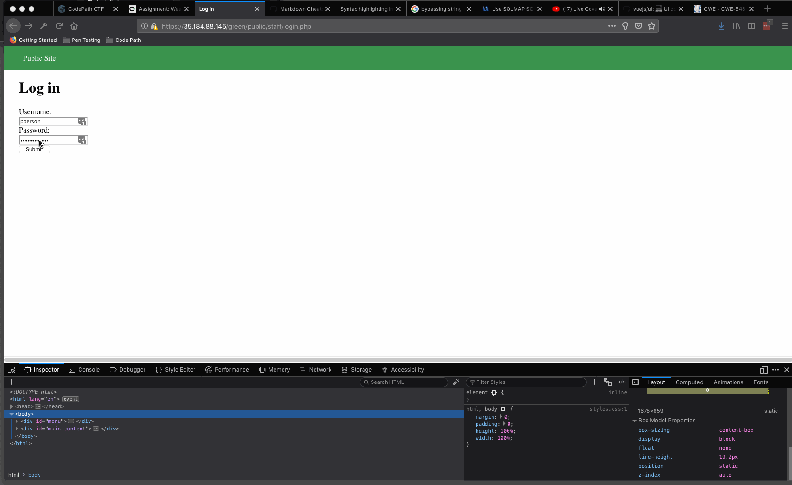
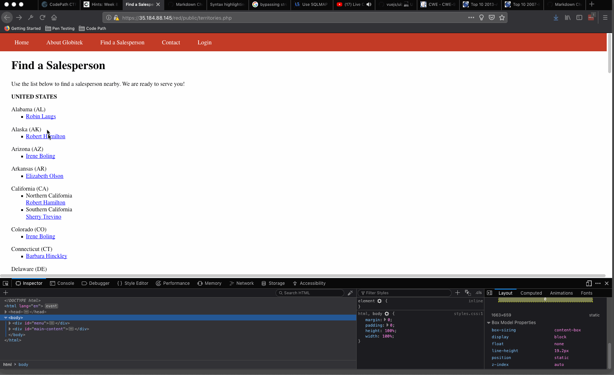

# Project 8 - Pentesting Live Targets

Time spent: **X** hours spent in total

> Objective: Identify vulnerabilities in three different versions of the Globitek website: blue, green, and red.

The six possible exploits are:
* Username Enumeration
* Insecure Direct Object Reference (IDOR)
* SQL Injection (SQLi)
* Cross-Site Scripting (XSS)
* Cross-Site Request Forgery (CSRF)
* Session Hijacking/Fixation

Each version of the site has been given two of the six vulnerabilities. (In other words, all six of the exploits should be assignable to one of the sites.)

## Common Vulnerabilities that apply to all targets.

Vulnerability #1: Directory Traversal

URL: https://35.184.88.145/blue/
URL: https://35.184.88.145/red/
URL: https://35.184.88.145/green/

REFERENCES:

[CWE 548](https://cwe.mitre.org/data/definitions/548.html)

ANALYSIS:
It is possible to view the directory listing. Directory listing may reveal hidden scripts, include files, backup source files etc which can be accessed to read sensitive information. To correct this routing for /Blue/ should result routing the user to /blue/public/. 

SCREENSHOTS:


STEPS TO RECREATE:
1. simply navigate to any of the following links.
[blue](https://35.184.88.145/blue/)
[red](https://35.184.88.145/red/)
[green](https://35.184.88.145/green/)


INFORMATION EXTRACTED:
Apache/2.4.18 (Ubuntu) Server at 35.184.88.145 Port 443

## Blue

Vulnerability #1: SQL Injection (SQLi)

URL: https://35.184.88.145/blue/public/salesperson.php?id=7%27%20OR%20SLEEP(5)--%27 

VULNERABILITY:

[CWE 89](https://cwe.mitre.org/data/definitions/89.html)

ANALYSIS:
The page results were successfully manipulated using the boolean conditions [7' AND '1'='1' -- ] and [7' AND '1'='2' -- ]
The parameter value being modified was NOT stripped from the HTML output for the purposes of the comparison
Data was returned for the original parameter.
The vulnerability was detected by successfully restricting the data originally returned, by manipulating the parameter

The vulnerability is confirmed by using [id=7' OR SLEEP(5)=0-- ] will cause the site to wait 5 seconds before loading.

SCREENSHOTS:


STEPS TO RECREATE:
1. Navigate to the link below.
- [Blue Salesperson](https://35.184.88.145/blue/public/salesperson.php?id=7)
2. Append the following code to the end of the address.
```
' OR SLEEP(5)=0--'
```
3. you will then see that it takes five seconds for the page to refresh. You can further test this by changing the ID of the salesperson that you want to see.

Vulnerability #2: 

URL:

VULNERABILITY:

ANALYSIS:

SCREENSHOTS:


## Green

Vulnerability #1: Username Enumeration

URL: https://35.184.88.145/green/public/staff/login.php

VULNERABILITY:

[CWE 203](https://cwe.mitre.org/data/definitions/203.html)
[OWASP Information Leakage and Improper Error Handling](https://www.owasp.org/index.php/Top_10_2007-Information_Leakage_and_Improper_Error_Handling)

ANALYSIS:

The username error markup is generated differently depending upon if an acutal or incorrect user name is presented.

If an incorrect username is presented the error shows as bold text and this is the result of the below class tag.
```html
<li>
	<span class="failed">
		Log in was unsuccessful.
	</span>
</li>
```

If a correct username is presented the error shows as normal text and this the result of below class tag.
```html
<li>
	<span class="failure">
		Log in was unsuccessful.
	</span>
</li>
```

SCREENSHOTS:


STEPS TO RECREATE:
1. navigate to [blue login](https://35.184.88.145/green/public/staff/login.php)
2. Try a known username such as the defualt ```pperson``` with an incorrect password in order to cuase a login error..
 - Notice the error message styling.
 3. Try an uknown usernamne such as ```person``` with another passowrd.
 - Notice the modified error message styling. 

Vulnerability #2: __________________

URL: 

VULNERABILITY:

ANALYSIS:

SCREENSHOTS:


## Red

Vulnerability #1: Insecure Direct Object Reference (IDOR)

URL: https://35.184.88.145/red/public/salesperson.php?id=1

VULNERABILITY:
[CWE 202](https://cwe.mitre.org/data/definitions/202.html)
[CWE 932](https://cwe.mitre.org/data/definitions/932.html)
[OWASP Insecure Direct Object Request](https://www.owasp.org/index.php/Top_10_2013-A4-Insecure_Direct_Object_References)

ANALYSIS:
Given the nature of this exploit it is as the result of allowing users to query the ID of sales people who should not be avaialble to the public.
The situion could have been mitigated simply by checking of the user is logged into the site with the proper permissions or simply querying the database only for those outside sales people who were available for external contact.

SCREENSHOTS:


STEPS TO RECREATE:
1. Navigate to the [Green salesperson site](https://35.184.88.145/red/public/territories.php)
2. Click on one of the sales people.
3. Notce that the url ```https://35.184.88.145/red/public/salesperson.php?id=1``` ends with ```id=<some number>```
4. Put either ```id=10``` or ```id=11``` after the ? in the URL.
5. Notice that both of those pull up sales people that were either fired or are not currently available.

Vulnerability #2: __________________

URL:

VULNERABILITY:

ANALYSIS:

SCREENSHOTS:


## Notes

CREATED USER:

UN: bsmith
PW: 4clU1$&S%HNt 

Describe any challenges encountered while doing the work

## Recon

# Nmap
```
[*] Nmap: Starting Nmap 7.70 ( https://nmap.org ) at 2018-11-05 15:41 EST
[*] Nmap: Nmap scan report for 145.88.184.35.bc.googleusercontent.com (35.184.88.145)
[*] Nmap: Host is up (0.048s latency).
[*] Nmap: Not shown: 995 filtered ports
[*] Nmap: PORT     STATE  SERVICE
[*] Nmap: 22/tcp   open   ssh
[*] Nmap: 80/tcp   open   http
[*] Nmap: 443/tcp  open   https
[*] Nmap: 3389/tcp closed ms-wbt-server
[*] Nmap: 8080/tcp closed http-proxy
```
